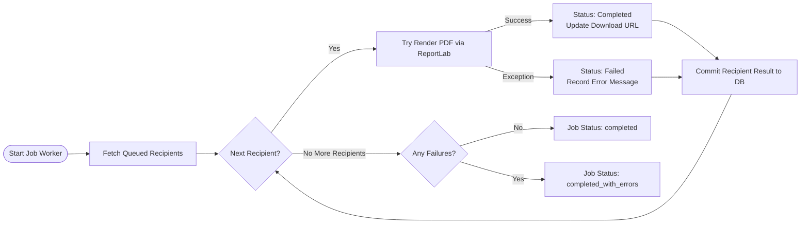

# Aereo Bulk Certificate Generator API

A high-performance backend REST API for generating PDF certificates in bulk. Built with Python 3.11, FastAPI, SQLAlchemy, SQLite, and ReportLab.

---

## 🎨 Sample Generated Certificate Output

Here is an example of a PDF certificate generated by the system:


---

## 📊 System Architecture & Workflow Flowcharts

### 1. High-Level Architecture Flowchart

```mermaid
flowchart TD
    Client[Client / Frontend / Script] -->|1. POST /jobs Payload| API[FastAPI Web Server]
    API -->|2. Validate Input| Pydantic[Pydantic V2 Validation]
    Pydantic -->|3. Persist Job & Certificates| DB[(SQLite Database)]
    API -->|4. Return 202 Accepted & Job ID| Client
    API -->|5. Queue Job| Worker[Background Worker Task]
    Worker -->|6. Render PDF Template| ReportLab[ReportLab PDF Engine]
    ReportLab -->|7. Save File .pdf| Disk[PDF File Storage]
    Worker -->|8. Update Status completed/failed| DB
    Client -->|9. GET /jobs/{job_id}| API
    Client -->|10. GET /certificates/{id}/download| API
```

### 2. Individual Certificate Generation & Fault Isolation Workflow



---

## ✨ Key Features

- **Asynchronous Bulk Processing**: Submitting a job with hundreds of recipients returns immediately (`202 Accepted`). Certificate generation executes in the background without blocking the web worker.
- **Per-Certificate Fault Isolation**: If rendering fails for one recipient, the error is logged specifically for that recipient while remaining certificates complete successfully.
- **Relational Data Storage**: Clean separation between `GenerationJob` tracking and individual `Certificate` records backed by SQLite.
- **Vector PDF Output**: Generates styled PDF certificates with branded colors, custom typography, dynamic text width wrapping, and decorative vectors via ReportLab.
- **Interactive Documentation**: Auto-generated Swagger UI and ReDoc interfaces.

---

## 🛠️ Technical Stack

- **Framework**: FastAPI (Python 3.11+)
- **Database / ORM**: SQLite + SQLAlchemy 2.0 (Declarative Mapping)
- **Validation**: Pydantic v2 (email format validation, payload size constraints)
- **PDF Engine**: ReportLab 4.x
- **Testing**: Pytest

---

## 🚀 Getting Started

### 1. Prerequisites
Ensure Python 3.11 or newer is installed on your system.

```bash
python --version
```

### 2. Project Setup

Clone the repository and create a virtual environment:

```powershell
# Create virtual environment
python -m venv .venv

# Activate virtual environment (Windows PowerShell)
.\.venv\Scripts\Activate.ps1

# Install dependencies
pip install -r requirements.txt
```

---

## 💻 Running the Application

Start the Uvicorn development server:

```powershell
uvicorn app.main:app --reload
```

The API will start at `http://127.0.0.1:8000`.

- **Root Endpoint / Status**: [http://127.0.0.1:8000/](http://127.0.0.1:8000/)
- **Interactive OpenAPI (Swagger UI)**: [http://127.0.0.1:8000/docs](http://127.0.0.1:8000/docs)
- **ReDoc Documentation**: [http://127.0.0.1:8000/redoc](http://127.0.0.1:8000/redoc)

---

## 🧪 Running Automated Tests

Run the full test suite using `pytest`:

```powershell
py -3.11 -m pytest -v
```

### What the Tests Cover
- **`test_create_generation_job`**: Validates job creation, UUID assignment, and initial `queued` state.
- **`test_input_validation_invalid_email`**: Asserts that malformed email addresses trigger 422 Unprocessable Entity errors.
- **`test_input_validation_empty_recipients`**: Prevents empty recipient arrays from creating empty jobs.
- **`test_certificate_generation_and_progress`**: Verifies background PDF generation, file creation, and status transition to `completed`.
- **`test_individual_certificate_failure_isolation`**: Confirms that a single failing recipient updates job status to `completed_with_errors` without stopping other certificates.
- **`test_retrieve_generated_certificate`**: Ensures output PDFs are correctly served via `FileResponse`.
- **`test_not_found_handlers`**: Checks 404 behavior for invalid job and certificate UUIDs.
- **`test_list_jobs`**: Verifies job listing endpoints.

---

## 📖 API Guide & Usage Examples

### 1. Create a Bulk Certificate Job

Send a `POST` request to `/jobs` with course metadata and recipient details:

**Endpoint**: `POST /jobs`

**Request Body**:
```json
{
  "course_name": "Drone Data Fundamentals",
  "issued_at": "2026-10-07",
  "recipients": [
    {
      "name": "Asha Rao",
      "email": "asha@example.com"
    },
    {
      "name": "Ravi Shah",
      "email": "ravi@example.com"
    }
  ]
}
```

**PowerShell Example**:
```powershell
$body = @{
    course_name = "Drone Data Fundamentals"
    issued_at   = "2026-10-07"
    recipients  = @(
        @{ name = "Asha Rao"; email = "asha@example.com" },
        @{ name = "Ravi Shah"; email = "ravi@example.com" }
    )
} | ConvertTo-Json -Depth 4

$job = Invoke-RestMethod -Method Post -Uri "http://127.0.0.1:8000/jobs" -ContentType "application/json" -Body $body
$job
```

---

### 2. List All Jobs

Retrieve a summary list of all certificate generation jobs:

```powershell
Invoke-RestMethod -Method Get -Uri "http://127.0.0.1:8000/jobs"
```

---

### 3. Check Job Status & Progress

Poll the job status using the `id` returned from job creation:

```powershell
Invoke-RestMethod -Method Get -Uri "http://127.0.0.1:8000/jobs/$($job.id)"
```

---

### 4. Download a Generated Certificate

Download the PDF file for a completed certificate:

**Endpoint**: `GET /certificates/{certificate_id}/download`

```powershell
$certId = $job.certificates[0].id
Invoke-WebRequest -Uri "http://127.0.0.1:8000/certificates/$certId/download" -OutFile "$HOME\Downloads\certificate.pdf"
```

---

## 📐 Design & Implementation Rationale

1. **FastAPI Background Tasks**: Bulk operations can involve hundreds of PDF generations. Executing PDF generation inside `BackgroundTasks` ensures the HTTP response returns immediately (`202 Accepted`), maintaining API responsiveness.
2. **Fault Isolation per Recipient**: Rather than failing an entire batch when one recipient record encounters an error, each PDF rendering step is wrapped in a `try...except` block. Failed items are recorded with their error message while successful ones receive download URLs.
3. **ReportLab Canvas Rendering**: ReportLab allows programmatically positioning precise graphics, borders, badges, and dynamic text width scaling to prevent text overflow on long recipient names.
4. **SQLite with SQLAlchemy 2.0**: Provides zero-configuration persistence for development and testing while maintaining strict data integrity via Foreign Key relationships (`GenerationJob` -> `Certificate`).

---

## 👤 Author Information

- **Name**: Bandi Hemanth
- **Email**: hemanthbandi0963@gmail.com
- **Phone**: +91 8341865795
